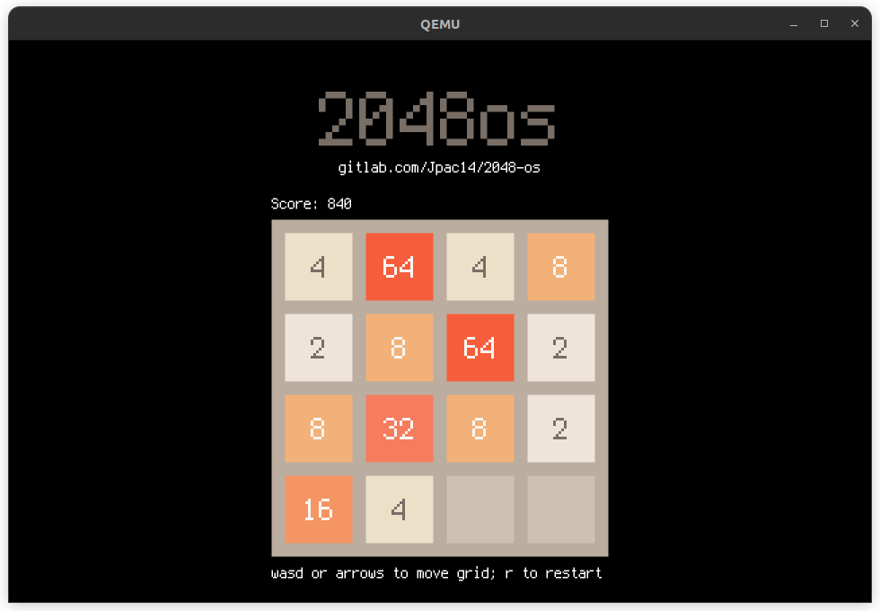

# 2048-os: an operating system to play 2048



## Features
- Plays 2048
- 64-bit (x86_64)
- Classic 2048 colour palette
- Doubled-buffered 30 FPS graphics at 1280x800 pixels with 32-bit RGB

## Running
**NOTE**: This has *only* been tested in an emulator. Real hardware might not work. Feel free to give it a shot though.

### Linux/MacOS
```
$ make run
```

### Windows
No idea.